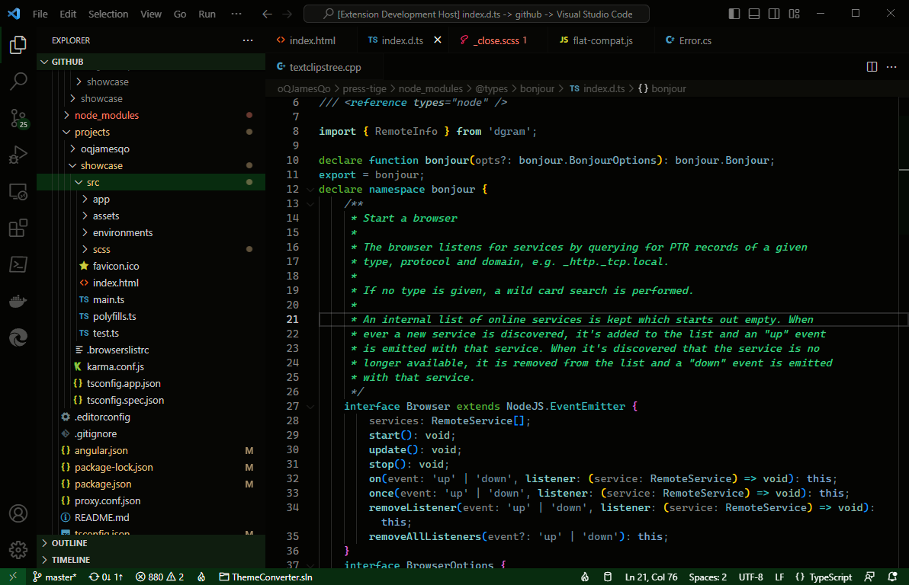

# Darklee Theme Set
> ## A set of Visual Studio Code themes that are on the dark side of the moon. 
> ### Themes Included
> - #### Deep Dark
> - #### Army

---

 

## Installation

1. Open the extensions sidebar on Visual Studio Code
1. Search for Darklee
1. Click Install
1. Select the settings button on the bottom left > Color Theme ＞ Choose one of 
    - "Darklee - Army"
    - "Darklee - Deep Dark"
1. Consider rating it in the market place

 

# Theme Screenshots

## Deep Dark
   
   
   
   
## Army
   
## License
[MIT](./LICENSE) 
## Developer Information
**GitHub: [oQJamesQo](https://github.com/oQJamesQo)**
## Issues & Suggestions
Please use [GitHub issues](https://github.com/oQJamesQo/oqjamesqo-darkly/issues) for issues and suggestions
